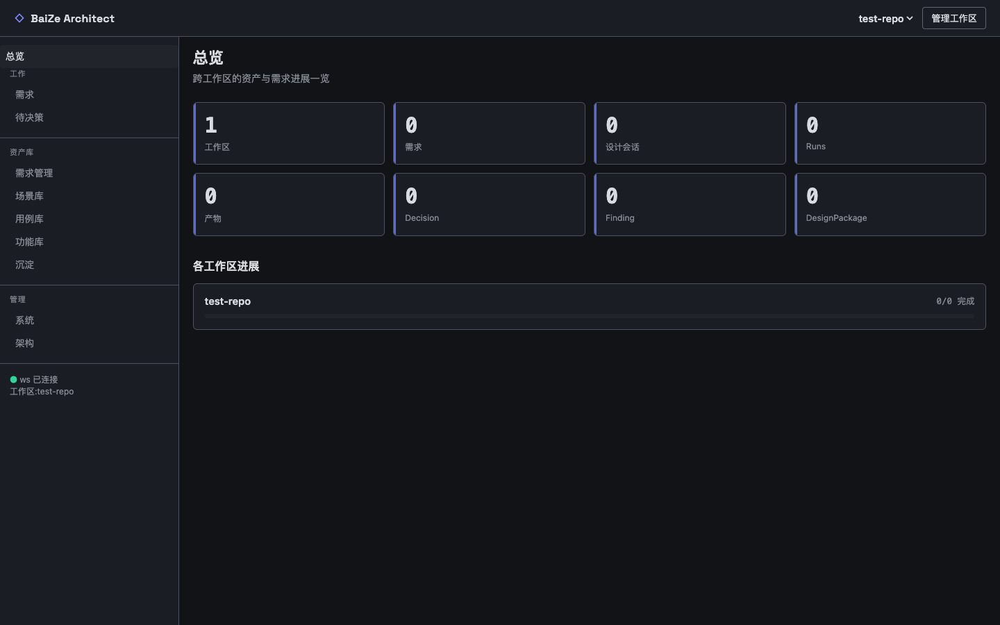
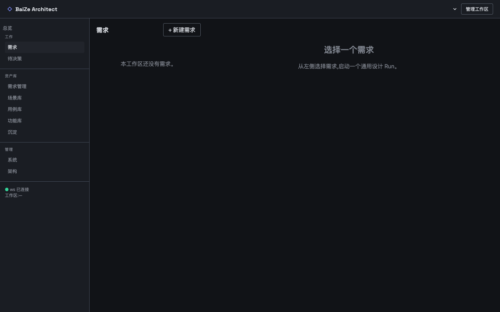
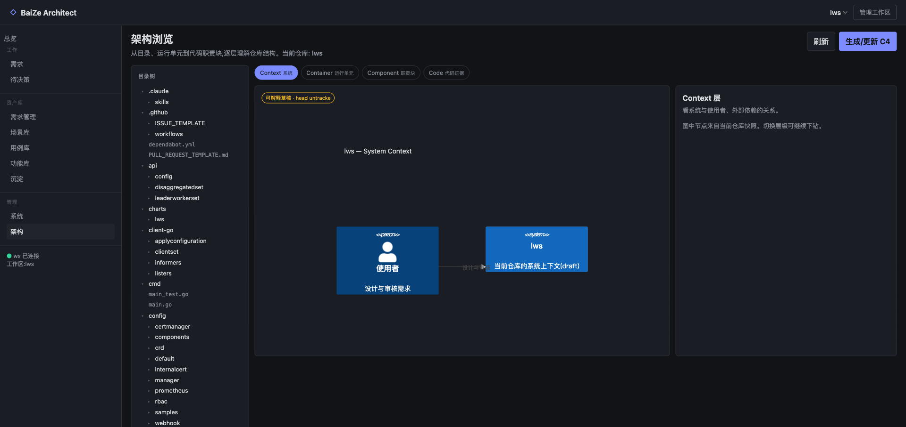
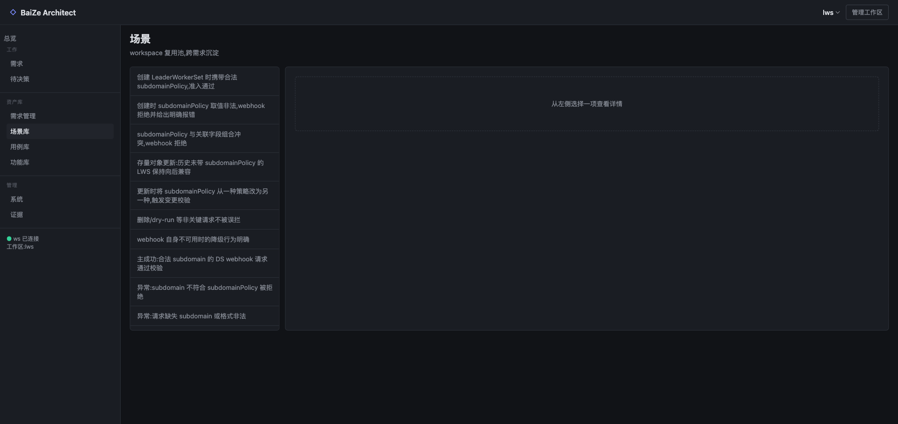

# BaiZe Architect

<p align="center">
  
</p>

<p align="center">
  <strong>证据驱动的需求设计 Agent</strong><br />
  从代码仓库中提取真实架构证据，辅助完成需求分析、场景建模、用例设计、功能拆解与方案归档。
</p>

<p align="center">
  <a href="#快速体验">快速体验</a> ·
  <a href="#核心能力">核心能力</a> ·
  <a href="#界面预览">界面预览</a> ·
  <a href="#本地开发">本地开发</a>
</p>

---

## 为什么是 BaiZe Architect

BaiZe Architect 面向“辅助需求设计”的领域 Agent，而不是通用聊天机器人。它围绕一个代码仓库建立证据上下文，帮助团队把已有系统能力转化为可复用的设计资产，并在每次需求设计中沉淀：

- **需求分析结论**：将业务目标拆解为可执行的设计任务。
- **场景库 / 用例库 / 功能库**：跨需求复用的设计资产，支持手动新增、删除、导入和导出。
- **代码证据**：方案中的判断必须回到仓库事实、架构快照和符号证据。
- **独立评审**：通过 critic/reviewer 对设计方案进行复核，降低幻觉和遗漏。
- **设计归档**：输出 Design Package、ADR 和可复用经验，反哺后续需求。

## 核心能力

| 能力 | 说明 |
| --- | --- |
| 需求工作台 | 创建需求、发起 Run、查看长任务事件流与阶段性产物。 |
| 证据驱动设计 | 基于 GitNexus / 架构快照读取仓库事实，避免脱离代码现状的设计。 |
| 资产库 | 管理需求、场景、用例、功能与沉淀资产；支持既有资产 JSON 导入和导出。 |
| 架构浏览 | 以 C4 视角浏览 Context / Container / Component / Code 层级关系。 |
| 持久运行 | Gateway 单进程承载 Web、SQLite、SSE 事件流与持久 Agent 会话。 |
| 容器体验 | 提供自包含 demo/test 环境，不挂载宿主目录，运行数据随容器销毁。 |

## 界面预览

### 需求设计工作台

<p align="center">
  
</p>

### 架构证据浏览

<p align="center">
  
</p>

### C4 交互式架构图

<p align="center">
  
</p>

### 资产库

<p align="center">
  
</p>

## 快速体验

`demo` 服务提供一个可交互的本机体验环境：只发布到 `127.0.0.1:18789`，不挂载宿主目录或 Docker Volume；SQLite、证据索引、会话和设计归档全部写入容器内 tmpfs，容器删除后数据全部清除。

```bash
docker compose up -d demo    # 首次会自动构建镜像并种子化 fixtures/test-repo
docker compose ps            # 等待 STATUS 变为 healthy
open http://127.0.0.1:18789  # 打开 Web 控制台
```

体验步骤：

1. 打开控制台后，在「系统 → 设置」配置模型 provider / modelId / apiKey。
2. 在「工作区」页基于种子仓库 `/tmp/baize/repos/test-repo` 创建工作区。
3. 新建需求并触发通用 Run，在 Run Rail 中观察事件流与归档结果。
4. 在「资产库」中查看或导入已有场景、用例、功能资产。

停止并清除体验环境：

```bash
docker compose down
```

## Docker 测试环境

Docker 测试镜像用于一次性集成测试，不承担开发数据持久化或产物交付。测试镜像包含应用、Web SPA、技能、Schema、GitNexus 和固定测试仓库；运行时数据全部写入容器内 `/tmp`。

```bash
docker compose build test
docker compose run --rm test
```

测试完成后容器立即删除。Compose 配置具有以下约束：

- 不挂载任何宿主目录或 Docker Volume。
- 不向宿主暴露端口。
- 运行阶段禁用外部网络。
- 根文件系统只读，唯一可写位置是容器内 tmpfs `/tmp`。
- 使用非 root 的 `node` 用户运行。
- SQLite、证据、GitNexus 索引、设计归档和临时仓库都随容器删除。
- 不需要模型 API Key；冒烟测试只验证 Run 控制面终态，不依赖模型产出。

## 本地开发

```bash
cd agent-runtime
npm ci
npm test
npm run typecheck

cd ../web
npm ci
npm run typecheck
npm run build
```

## 目录结构

```text
agent-runtime/   单进程 Gateway、Agent Runtime、SQLite Store、领域工具
web/             Lit + Vite Web 控制台
docs/            设计文档、验收截图与架构记录
fixtures/        容器体验与测试使用的种子仓库
scripts/         冒烟测试与辅助脚本
```

## 状态说明

BaiZe Architect 仍在快速演进中。历史多服务、PostgreSQL 和宿主目录挂载方案均已废弃，不应再作为部署依据。
