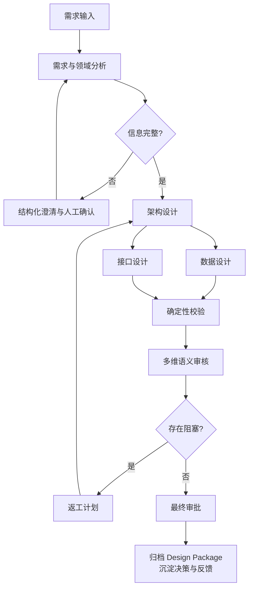
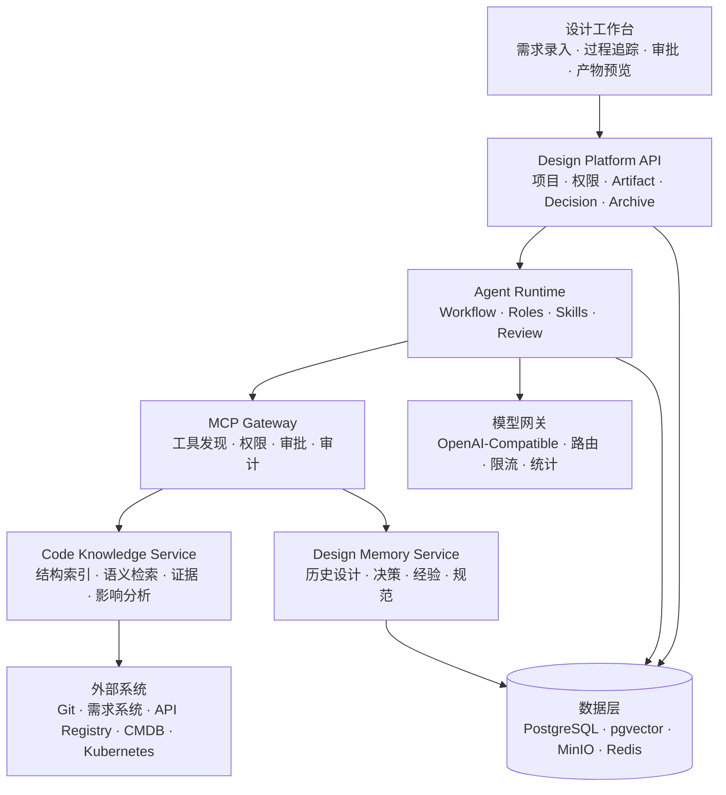
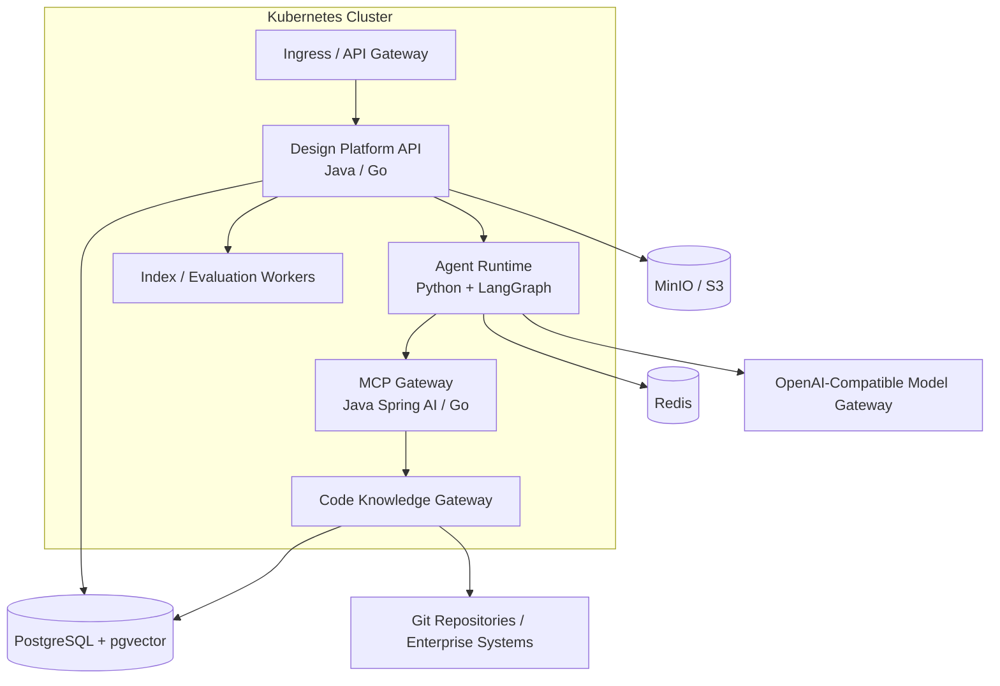
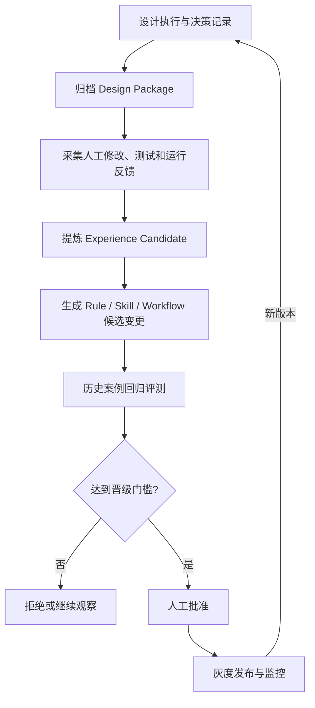

# 智能需求设计与决策治理 Agent 系统

> 软件需求规格说明书（SRS）与总体设计  
> 开发输入基线 · Version 0.1

**文档定位**

> 面向企业存量软件系统的需求变更设计、决策治理、设计归档与受控知识进化平台。本文档用于产品立项、架构评审、MVP 开发拆解和验收。

编制日期：2026-07-17

文档状态：开发输入草案（待架构评审确认）

# 文档控制

| **项目** | **内容**                                                                            |
|----------|-------------------------------------------------------------------------------------|
| 文档名称 | 智能需求设计与决策治理 Agent 系统——软件需求规格说明书与总体设计                     |
| 版本     | V0.1                                                                                |
| 状态     | 开发输入草案                                                                        |
| 适用阶段 | 产品立项、架构评审、MVP 开发、系统验收                                              |
| 目标读者 | 产品负责人、架构师、后端开发、Agent 工程师、测试、平台运维、安全与评审人员          |
| 基线原则 | 本文档中的数值指标为 MVP 建议目标；涉及组织规范和容量规格的内容须在正式立项时确认。 |

## 版本记录

| **版本** | **日期**   | **说明**                                                                       | **状态** |
|----------|------------|--------------------------------------------------------------------------------|----------|
| V0.1     | 2026-07-17 | 整合需求、角色、工作流、Skill、MCP、决策归档和受控进化方案，形成首版开发输入。 | 草案     |

# 目录

> 1\. 项目概述
>
> 2\. 产品定位与范围
>
> 3\. 用户角色与核心场景
>
> 4\. 功能需求
>
> 5\. Agent 角色与协作模型
>
> 6\. 设计工作流
>
> 7\. 系统总体架构
>
> 8\. Skill 体系设计
>
> 9\. MCP 与代码知识库设计
>
> 10\. 设计产物、决策与数据模型
>
> 11\. 记忆、经验与受控进化
>
> 12\. 外部接口与前端交互
>
> 13\. 非功能需求
>
> 14\. 安全与治理
>
> 15\. 可观测性与运营指标
>
> 16\. MVP 范围与演进路线
>
> 17\. 开发任务拆解
>
> 18\. 测试与验收
>
> 19\. 风险与待决策事项
>
> 附录 A. 示例结构

## 阅读与使用说明

- P0 为 MVP 必须项，P1 为试点增强项，P2 为受控进化阶段能力。

- 本文档中的容量与质量数值为建议目标，正式立项时应结合试点基线确认。

- 开发任务、接口、测试用例和 ADR 应引用对应 FR/NFR/AC 编号。

- Artifact JSON Schema、DecisionRecord 和 MCP Tool Schema 是首批需要冻结的开发契约。

# 1. 项目概述

## 1.1 背景

AI Coding 提升了编码速度，但软件交付的约束正在前移到需求澄清、存量系统理解、设计决策、跨产物一致性和审核治理。现有工具多集中在代码生成或单次文档生成，无法持续回答“为什么这样设计、基于哪一版代码、影响哪些模块、最终效果如何”等问题。

本项目拟建设一个面向企业存量系统的智能需求设计与决策治理平台：以确定性工作流编排专业 Agent，以 Skill 复用设计方法，以 MCP 连接代码和企业系统，以结构化 Artifact 保存设计结果，并通过人工反馈、测试结果和运行效果形成受控的知识演进闭环。

## 1.2 建设目标

- 将非结构化需求转化为可评审、可追踪的需求基线和领域模型。

- 结合存量代码、接口、数据模型和部署配置生成变更设计，而非脱离现状生成通用方案。

- 识别并记录关键决策点，保存备选方案、约束、依据、后果、审批和复审条件。

- 生成架构、数据、接口等结构化设计产物，并执行程序化校验和多维语义审核。

- 归档完整 Design Package，支持版本对比、历史追溯、相似设计检索和影响分析。

- 从人工修改、开发测试和线上结果中生成候选经验，经评测和审批后更新规则或 Skill。

## 1.3 产品定位

> **推荐定位：**面向企业存量软件的智能需求变更设计与决策治理平台。核心竞争力不是“多个 Agent 生成文档”，而是需求、代码、设计、决策、审核和实施反馈的可追踪闭环。

## 1.4 术语

| **术语**       | **定义**                                                                            |
|----------------|-------------------------------------------------------------------------------------|
| Agent Role     | 承担稳定职责边界的专业角色，例如架构设计师或评审协调器。                            |
| Skill          | 可复用、可版本化、具有明确输入输出和质量门禁的设计方法。                            |
| MCP            | Agent 访问外部数据、知识和工具的标准化接口层。                                      |
| Artifact       | 结构化、版本化的设计产物；Markdown、Word、PDF 仅为展示格式。                        |
| DecisionRecord | 记录问题背景、候选方案、选择理由、后果、证据和审批的决策实体。                      |
| Design Package | 某次设计基线的完整归档包，包含需求、架构、数据、接口、决策、审核、证据和评测信息。  |
| Experience     | 从真实案例和实施结果中提炼、具有作用域、证据和有效期的经验条目。                    |
| 受控进化       | Agent 自动提出规则或 Skill 变更，经回归评测、人工批准、灰度发布和可回滚管理后生效。 |

# 2. 产品定位与范围

## 2.1 目标用户

| **用户**          | **核心诉求**                                           |
|-------------------|--------------------------------------------------------|
| 需求/产品负责人   | 快速澄清范围、约束和验收条件，减少需求歧义。           |
| 架构师/技术负责人 | 基于存量系统形成候选设计、决策对比和影响范围。         |
| 后端/平台开发     | 获得可直接实施的接口、数据、组件变更和任务拆解。       |
| 评审人员          | 获得带证据的风险、遗漏和一致性问题，而非空泛审核意见。 |
| 研发效能/平台团队 | 沉淀企业设计规范、历史案例、Skill 和评测数据。         |
| 知识管理员        | 管理经验作用域、有效性、冲突、版本和晋级。             |

## 2.2 首要应用场景

- 基于现有 Java/Go 后端代码仓，为新增或改造需求生成设计方案。

- 识别已有能力，避免重复建设，并定位需要修改的模块、接口、数据和部署资源。

- 针对 AI 推理平台、Kubernetes 平台、文件传输、存储与容灾、微服务集成等场景生成设计。

- 在设计评审前完成需求覆盖、字段一致性、接口规范和风险预审。

- 设计完成后形成版本化归档，并在后续开发、测试和运行阶段补充结果反馈。

## 2.3 MVP 范围内

| **能力域** | **MVP 范围**                                                 |
|------------|--------------------------------------------------------------|
| 项目与基线 | 项目、代码仓、需求版本、设计运行和审批状态管理。             |
| 需求分析   | 范围、角色、场景、约束、验收条件、开放问题和领域对象提取。   |
| 专业设计   | 架构、REST/OpenAPI、PostgreSQL 数据设计和变更影响。          |
| 代码知识   | 单仓或少量仓的结构索引、符号查询、调用路径、证据和影响分析。 |
| 评审       | 确定性校验、需求覆盖、跨产物一致性和语义审核。               |
| 决策治理   | 关键决策候选、审批、版本、替代关系和复审触发条件。           |
| 归档       | 生成并保存 Design Package，支持版本对比和历史检索。          |
| 反馈       | 记录人工修改、开发和测试反馈；MVP 不自动修改 Skill。         |

## 2.4 MVP 范围外

- 完全自动替代架构师或设计负责人完成重大业务和技术决策。

- 自动修改生产代码、生产数据库或生产环境配置。

- 未经人工审批自动发布 Skill、Prompt、工作流或企业设计规范。

- 首版覆盖所有数据库、云平台、前端 UX、算法设计和全部编程语言。

- 将聊天记录本身作为唯一系统状态或长期知识来源。

# 3. 用户角色与核心场景

## 3.1 人工业务角色

| **角色**   | **职责**                                 | **关键权限** |
|------------|------------------------------------------|--------------|
| 项目负责人 | 创建项目、确定需求基线、分配设计负责人。 | 项目管理     |
| 设计负责人 | 审批重大决策、裁决冲突、批准最终设计。   | 审批与发布   |
| 专业评审人 | 针对安全、数据、接口、可靠性等维度评审。 | 审核意见     |
| 知识管理员 | 审批经验、Skill 变更和作用域晋级。       | 知识治理     |
| 普通参与者 | 查看设计、提交补充信息和反馈。           | 只读或评论   |

## 3.2 核心用户旅程

1.  创建项目并关联代码仓、需求资料和组织规范。

2.  启动设计运行，系统完成代码索引状态检查和上下文准备。

3.  需求与领域分析师生成结构化需求，并提出需要人工回答的高价值问题。

4.  需求基线确认后，架构、数据和接口角色生成设计候选。

5.  系统执行格式、引用、覆盖率和一致性校验，再由评审角色进行语义审核。

6.  针对阻塞问题生成返工任务；重大决策由人工批准。

7.  最终设计通过后生成 Design Package，并绑定代码 Commit 和 Skill/模型版本。

8.  开发、测试和运行阶段补充结果反馈，形成候选经验。

# 4. 功能需求

> **编号规则：**FR 为功能需求，NFR 为非功能需求，AC 为验收场景。所有开发任务和测试用例应回链到需求编号。

| **编号** | **能力**       | **需求说明**                                                      | **优先级** |
|----------|----------------|-------------------------------------------------------------------|------------|
| FR-001   | 项目管理       | 创建、更新、归档设计项目；维护负责人、成员和访问权限。            | P0         |
| FR-002   | 需求基线       | 导入文本、文档或需求系统内容，形成不可变的需求版本和基线。        | P0         |
| FR-003   | 代码仓关联     | 关联仓库、分支和 Commit；记录索引版本及可访问范围。               | P0         |
| FR-004   | 设计运行       | 创建、暂停、恢复、取消设计运行，保存状态和检查点。                | P0         |
| FR-005   | 过程事件流     | 通过 SSE 展示阶段、角色、工具调用、审核和等待审批状态。           | P0         |
| FR-006   | 需求结构化     | 提取目标、范围、用户、场景、功能、NFR、约束、假设和验收条件。     | P0         |
| FR-007   | 澄清问题       | 识别缺失和冲突，生成结构化问题并记录用户回答。                    | P0         |
| FR-008   | 领域建模       | 生成业务术语、领域实体、关系、状态和关键规则。                    | P0         |
| FR-009   | 工作流编排     | 依据阶段、依赖和风险选择角色、Skill、MCP 和人工门禁。             | P0         |
| FR-010   | 并行设计       | 在架构基线和领域模型完成后，并行执行数据与接口设计。              | P1         |
| FR-011   | 架构设计       | 生成系统边界、组件变更、依赖、部署影响、质量属性响应和 ADR 候选。 | P0         |
| FR-012   | 数据设计       | 生成数据实体、表结构、索引、一致性、生命周期和迁移方案。          | P0         |
| FR-013   | 接口设计       | 生成 REST/OpenAPI、错误码、鉴权、幂等、分页和兼容性策略。         | P0         |
| FR-014   | 确定性校验     | 校验 JSON Schema、OpenAPI、SQL、引用、枚举、命名和追踪覆盖。      | P0         |
| FR-015   | 语义审核       | 从需求覆盖、架构、数据、接口、安全、可靠性和可测试性维度审核。    | P0         |
| FR-016   | 返工闭环       | 将审核问题分派给责任角色，限制自动返工轮次并保留差异。            | P0         |
| FR-017   | 人工审批       | 支持需求基线、重大决策、阻塞问题裁决和最终发布审批。              | P0         |
| FR-018   | 代码结构索引   | 索引符号、模块、路由、调用关系和基础设施资源。                    | P0         |
| FR-019   | 代码检索       | 支持符号、文本、语义和混合模式检索，并提供过滤条件。              | P0         |
| FR-020   | 代码证据       | 所有关键代码结论可引用仓库、Commit、文件、符号和行号。            | P0         |
| FR-021   | 依赖追踪       | 查询调用者、被调用者、实现、路由、事件和跨模块依赖。              | P0         |
| FR-022   | 影响分析       | 输入需求或候选变更，输出受影响模块、接口、数据、测试和风险。      | P0         |
| FR-023   | 决策发现       | 专业角色在设计过程中输出潜在重大决策点和备选方案。                | P0         |
| FR-024   | 决策管理       | 管理决策状态、审批、替代关系、后果、证据和复审触发条件。          | P0         |
| FR-025   | Artifact 管理  | 设计产物以结构化版本保存，支持 Patch、比较、锁定和回滚。          | P0         |
| FR-026   | 设计归档       | 批准后生成包含完整上下文与版本信息的 Design Package。             | P0         |
| FR-027   | 历史检索       | 按项目、领域、技术栈、决策和语义检索历史设计与案例。              | P1         |
| FR-028   | 反馈记录       | 记录人工修改、开发偏差、测试问题、线上问题和效果指标。            | P1         |
| FR-029   | 经验候选       | 基于设计与结果生成有证据、作用域和适用条件的候选经验。            | P1         |
| FR-030   | Skill Registry | 管理 Skill 的版本、依赖、输入输出、权限、测试和发布状态。         | P1         |
| FR-031   | 评测与晋级     | 对候选规则或 Skill 执行历史案例回归评测，并进行人工晋级。         | P2         |
| FR-032   | MCP 管理       | 管理 MCP Server、工具白名单、权限、超时、审批和调用审计。         | P0         |
| FR-033   | 文档导出       | 导出 Markdown、Word、OpenAPI、图表和归档包。                      | P1         |
| FR-034   | 审计追踪       | 记录用户、Agent、Skill、模型和工具对产物与决策的所有关键操作。    | P0         |

## 4.1 功能边界原则

- 角色之间以 Artifact 引用和 Patch 协作，不以完整聊天历史作为主要协作介质。

- 能够程序化判断的问题优先使用规则和验证器，不交给大模型自由判断。

- 所有写操作必须经过工具级权限控制；生产环境写操作不纳入 MVP。

- 专业 Agent 只能写入自身负责的产物类型，评审角色默认只读。

- 设计结论应明确区分事实、静态分析推断、经验建议和待人工确认假设。

# 5. Agent 角色与协作模型

## 5.1 核心角色

| **角色**             | **职责**                              | **主要输出**                         | **边界**                   |
|----------------------|---------------------------------------|--------------------------------------|----------------------------|
| 设计工作流协调器     | 阶段、依赖、角色路由、返工、人工门禁  | TaskPlan、RunState                   | 不直接完成专业设计         |
| 需求与领域分析师     | 需求澄清、范围、领域模型、验收条件    | RequirementSpec、DomainModel         | 不替代业务负责人做范围决策 |
| 解决方案架构师       | 系统边界、组件、部署、质量属性、ADR   | ArchitectureSpec、DecisionCandidate  | 不直接修改数据和接口产物   |
| 数据与持久化设计师   | 数据模型、存储、索引、一致性、迁移    | DataSpec、MigrationPlan              | MVP 聚焦 PostgreSQL        |
| 接口与集成设计师     | API、事件、协议、错误、兼容性         | ApiSpec、OpenAPI                     | MVP 聚焦 REST/OpenAPI      |
| 评审协调器           | 组织规则校验与多维语义审核            | ReviewReport、Finding                | 只提问题，不直接重写设计   |
| 知识策展与进化管理器 | 归档后提炼经验、候选规则与 Skill 变更 | ExperienceCandidate、ChangeCandidate | 后台运行；不得自行晋级     |

## 5.2 条件专家

| **专家**     | **触发条件**                                 | **MVP 策略**                     |
|--------------|----------------------------------------------|----------------------------------|
| 安全与合规   | 认证授权、多租户、敏感数据、公网或合规要求   | 作为专项审核 Skill，后续独立角色 |
| 可靠性与性能 | 高并发、高可用、容灾、跨地域、大文件或强 SLA | 作为架构 Skill                   |
| 部署与运维   | Kubernetes、灰度、备份恢复、复杂可观测性     | 作为架构 Skill                   |
| 测试与验收   | 复杂状态机、兼容性、性能和容灾验证           | 作为评审维度                     |
| AI/算法专家  | 模型推理、RAG、GPU 调度或模型评测            | 按产品线扩展                     |

## 5.3 角色权限矩阵

| **角色**   | **代码知识** | **需求** | **架构** | **数据/API** | **决策**  | **发布** |
|------------|--------------|----------|----------|--------------|-----------|----------|
| 协调器     | 概览         | 读       | 读       | 读           | 创建候选  | 否       |
| 需求分析   | 检索/证据    | 写       | 读       | 读           | 创建候选  | 否       |
| 架构设计   | 全部只读     | 读       | 写       | 读           | 写候选    | 否       |
| 数据设计   | 全部只读     | 读       | 读       | 写数据       | 写候选    | 否       |
| 接口设计   | 全部只读     | 读       | 读       | 写接口       | 写候选    | 否       |
| 评审协调   | 全部只读     | 读       | 读       | 读           | 评论      | 否       |
| 知识策展   | 只读         | 读归档   | 读归档   | 读归档       | 经验候选  | 否       |
| 人工负责人 | 按项目       | 审批     | 审批     | 审批         | 批准/拒绝 | 是       |

## 5.4 角色设计原则

- 编排者是工作流控制器，不是全能 Agent；至少 80% 路由应由状态机和规则决定。

- 数据库设计和接口设计依赖统一领域模型，避免各自创造业务概念。

- 评审员应采用独立上下文和不同提示词，必要时使用不同模型降低错误相关性。

- 角色输出必须满足 JSON Schema，并附引用、假设和未解决问题。

- 简单需求允许合并角色；中型需求使用完整核心角色；高风险需求按条件启用专家。

# 6. 设计工作流



**图 1 需求设计主工作流**

## 6.1 状态定义

| **状态**                     | **说明**                       | **允许转移**                       |
|------------------------------|--------------------------------|------------------------------------|
| CREATED                      | 项目已创建，尚未准备上下文。   | CONTEXT_PREPARING                  |
| CONTEXT_PREPARING            | 检查代码索引、规范和历史资料。 | ANALYZING / BLOCKED                |
| ANALYZING                    | 需求与领域分析。               | WAITING_INPUT / REQUIREMENT_REVIEW |
| WAITING_INPUT                | 等待用户回答结构化问题。       | ANALYZING                          |
| REQUIREMENT_REVIEW           | 等待需求基线确认。             | DESIGNING / ANALYZING              |
| DESIGNING                    | 架构、数据和接口设计。         | VALIDATING                         |
| VALIDATING                   | 执行确定性校验。               | REVIEWING / REWORK                 |
| REVIEWING                    | 执行语义审核和专家评审。       | REWORK / FINAL_APPROVAL            |
| REWORK                       | 按 Finding 分派返工。          | DESIGNING / MANUAL_REVIEW          |
| FINAL_APPROVAL               | 人工最终确认。                 | ARCHIVING / REWORK                 |
| ARCHIVING                    | 固化版本并生成归档包。         | COMPLETED                          |
| COMPLETED                    | 设计运行完成。                 | 无                                 |
| BLOCKED / FAILED / CANCELLED | 阻塞、失败或取消。             | 恢复或终止                         |

## 6.2 人工门禁

| **门禁**        | **触发条件**                       | **人工动作**             |
|-----------------|------------------------------------|--------------------------|
| 需求基线确认    | 需求完整性达到阈值或存在待确认假设 | 批准、补充、退回         |
| 重大决策确认    | 高成本、不可逆、跨系统或业务权衡   | 选择方案或要求补充论证   |
| 阻塞问题裁决    | 自动返工两轮后仍存在 BLOCKER       | 接受风险、继续返工或终止 |
| 最终设计批准    | 所有必需 Artifact 通过校验和审核   | 发布或退回               |
| 经验/Skill 晋级 | 候选变更通过回归评测               | 批准灰度、拒绝或延迟     |

## 6.3 返工策略

- 自动返工默认最多 2 轮，超过后进入人工裁决。

- Finding 必须包含严重级别、责任角色、Artifact 位置、证据和建议动作。

- BLOCKER 必须关闭后才能进入最终审批；MAJOR 可由负责人明确接受风险；MINOR 可带意见归档。

- 返工使用 Patch 产生新版本，禁止覆盖已经批准的 Artifact。

# 7. 系统总体架构



**图 2 逻辑架构**

## 7.1 组件职责

| **组件**               | **职责**                                                       |
|------------------------|----------------------------------------------------------------|
| Design Workbench       | 需求录入、运行追踪、问题回答、设计预览、差异、评审和审批。     |
| Design Platform API    | 项目、权限、Artifact、Decision、归档、反馈和外部 API。         |
| Agent Runtime          | 工作流状态图、角色执行、结构化输出、检查点、重试和流式事件。   |
| Skill Runtime/Registry | Skill 发现、版本解析、输入校验、资源加载、执行和质量门禁。     |
| MCP Gateway            | MCP Server 注册、工具路由、权限、超时、审批、审计和结果裁剪。  |
| Code Knowledge Service | 仓库快照、结构索引、语义搜索、代码证据和变更影响。             |
| Design Memory Service  | 历史设计、决策、经验、规范和相似案例检索。                     |
| Evaluation Service     | 黄金案例、自动指标、LLM-as-judge 辅助、人工标注和版本比较。    |
| Model Gateway          | OpenAI-Compatible 接入、模型路由、Fallback、Token 和成本统计。 |

## 7.2 建议技术基线

| **层次**    | **建议选型**                       | **说明**                                                     |
|-------------|------------------------------------|--------------------------------------------------------------|
| Agent 编排  | Python + LangGraph                 | 适合显式状态图、持久化检查点、并行、返工和人工介入。         |
| 平台 API    | Java Spring Boot 或 Go             | 承载企业权限、项目、Artifact、审批和发布。                   |
| MCP Gateway | Java Spring AI MCP 或 Go MCP SDK   | 与现有企业服务集成，提供工具级治理。                         |
| 结构化模型  | Pydantic + JSON Schema             | 强制角色输入输出契约。                                       |
| 事务数据    | PostgreSQL                         | 项目、运行、Artifact、Decision、Finding、Experience 元数据。 |
| 向量检索    | pgvector（MVP）                    | 复用 PostgreSQL，后续按规模评估 OpenSearch/专用向量库。      |
| 对象存储    | MinIO / S3                         | 保存完整归档包、文档、图表和大文件。                         |
| 缓存/锁     | Redis                              | 短期状态、分布式锁、限流和事件缓冲。                         |
| 模型接入    | OpenAI-Compatible Model Gateway    | 屏蔽模型差异并统一路由、配额和统计。                         |
| 部署        | Kubernetes                         | Agent、索引和评测任务可独立扩缩容。                          |
| 可观测性    | OpenTelemetry + Prometheus/Grafana | 追踪运行、模型、Skill 和 MCP 调用。                          |

> **技术选型原则：**上述为建议基线。核心抽象必须与具体 Agent 框架、模型提供方和代码索引后端解耦，避免平台被单一工具锁定。

## 7.3 部署拓扑



**图 3 建议部署拓扑**

# 8. Skill 体系设计

## 8.1 Skill 定义

Skill 不是角色提示词，而是可组合、可测试、可版本化的专业设计过程。每个 Skill 必须声明触发条件、输入、输出、步骤、可用 MCP 工具、质量门禁、失败策略和版本。

**Skill Manifest 示例**

```yaml
name: rest-api-design
version: 1.0.0
description: 基于领域模型和架构边界生成 REST API 设计

inputs:
  requirement_spec: required
  domain_model: required
  architecture_spec: required

outputs:
  api_spec: schemas/api-spec.json
  openapi: openapi-3.1

allowed_tools:
  - code.search_code
  - code.find_symbol
  - api_registry.search

quality_gates:
  - all_write_operations_define_idempotency
  - all_error_responses_reference_error_catalog
  - all_entities_exist_in_domain_model
```

## 8.2 Skill 分层

| **层次**   | **示例**                                           | **说明**                      |
|------------|----------------------------------------------------|-------------------------------|
| 基础 Skill | 结构化输出修复、歧义检测、证据检查、Artifact Patch | 跨角色通用                    |
| 专业 Skill | C4 建模、ADR、REST、OpenAPI、表结构、索引、迁移    | 按专业角色使用                |
| 场景 Skill | AI 推理服务、文件传输、Kubernetes Operator、多租户 | 组合专业 Skill 并增加场景约束 |
| 审核 Skill | 需求覆盖、跨产物一致性、安全、可靠性、可测试性     | 评审协调器调用                |

## 8.3 首批 Skill 清单

| **角色** | **P0 Skill**                                | **来源策略**               |
|----------|---------------------------------------------|----------------------------|
| 协调器   | 任务分解、依赖规划、角色路由、返工路由      | 自研为主                   |
| 需求分析 | 访谈澄清、PRD/规格生成、领域术语、验收条件  | 复用成熟方法并改造 Schema  |
| 架构设计 | 架构模式、微服务模式、C4、ADR、质量属性分析 | 公共 Skill Fork + 企业规则 |
| 数据设计 | PostgreSQL 表设计、索引、迁移、一致性       | 公共 Skill + 自研校验器    |
| 接口设计 | API 原则、OpenAPI、错误码、幂等和兼容性     | 公共 Skill + 企业接口规范  |
| 评审协调 | 多维审核、威胁建模、覆盖和一致性            | 公共审核方法 + 确定性规则  |

## 8.4 外部能力复用策略

- BMAD 类项目：复用需求访谈、架构工作流、实施就绪检查和回顾方法。

- Spec Kit/OpenSpec 类项目：复用规格、澄清、变更目录、检查表和归档思路。

- 成熟工程 Skill 仓库：选择架构、API、PostgreSQL、ADR 和安全 Skill，并 Fork 到内部仓库。

- 现成 Agent 套件：复用角色提示词、Handoff、ADR 讨论和 Retrospective，不复用其文件状态作为平台核心数据。

- 引入任何第三方 Skill 前必须完成许可证、脚本权限、网络访问、Prompt Injection 和回归测试审查。

## 8.5 Skill 生命周期

| **状态**   | **含义**                             |
|------------|--------------------------------------|
| DRAFT      | 开发或改造中，不可用于生产运行。     |
| EVALUATING | 正在历史案例和安全沙箱中评测。       |
| CANARY     | 小范围灰度，必须绑定评测和回滚策略。 |
| STABLE     | 正式稳定版本。                       |
| DEPRECATED | 不再推荐，新运行不可默认选择。       |
| REVOKED    | 存在安全或质量问题，禁止执行。       |

# 9. MCP 与代码知识库设计

## 9.1 MCP 总体原则

- MCP 负责访问外部数据和执行工具，不承载角色职责和完整设计方法。

- 所有 MCP 调用必须经过 Gateway，执行工具白名单、参数 Schema、身份透传、超时、并发、审批和审计。

- 专业 Agent 默认只获得只读工具；写工具按风险分级并要求幂等键。

- 工具返回内容视为不可信数据，必须隔离外部文本中的提示注入。

## 9.2 Code Knowledge Gateway

MVP 建议以 codebase-memory-mcp 类结构索引能力为后端，并在上层建设稳定的 Code Knowledge Gateway。后续可增加语义向量检索或企业跨仓代码平台，避免上层角色直接依赖单一 MCP 的工具命名和数据模型。

| **工具**                 | **用途**                                                | **主要使用角色**   |
|--------------------------|---------------------------------------------------------|--------------------|
| get_repository_overview  | 语言、模块、入口、路由、数据存储、消息和 K8s 资源概览。 | 协调器、架构       |
| search_code              | symbol/text/semantic/hybrid 统一搜索。                  | 全部专业角色       |
| find_symbol              | 查找类、方法、接口、枚举、路由、配置和资源。            | 架构、数据、接口   |
| get_code_evidence        | 返回带仓库、Commit、文件、符号和行号的代码片段。        | 全部专业角色、评审 |
| trace_dependency         | 调用者、被调用者、实现、HTTP、事件和测试关系。          | 架构、评审         |
| analyze_change_impact    | 受影响模块、API、数据、测试和风险。                     | 架构、评审         |
| find_existing_capability | 按业务意图查找已有相似实现。                            | 需求、架构         |
| compare_revisions        | 比较版本之间的结构和实现变化。                          | 架构、评审         |

## 9.3 代码索引模型

| **字段**           | **说明**                                     |
|--------------------|----------------------------------------------|
| tenantId/projectId | 租户和设计项目隔离标识。                     |
| repositoryId       | 代码仓稳定标识，不使用仓库名作为唯一键。     |
| branch/commitSha   | 设计证据绑定的精确代码基线。                 |
| indexVersion       | 索引格式和构建批次。                         |
| parserVersion      | 语法解析和图构建版本。                       |
| indexedAt/status   | 索引时间和状态。                             |
| capabilities       | 支持的语言、符号、调用、路由和基础设施类型。 |

## 9.4 Design Memory MCP

| **类别**     | **接口示例**                                                                                                               |
|--------------|----------------------------------------------------------------------------------------------------------------------------|
| Resources    | design://packages/{id}；decision://projects/{id}/{decisionId}；experience://domains/{domain}；standard://organization/{id} |
| 只读 Tools   | search_similar_designs、search_decisions、search_experiences、get_applicable_standards、compare_design_versions            |
| 受控写 Tools | create_decision_candidate、archive_design_package、record_feedback、create_experience_candidate                            |
| 管理 Tools   | approve_experience、publish_skill_version、rollback_skill_version；仅知识管理员可用                                        |

## 9.5 MCP 风险等级

| **风险**   | **示例**                                     | **控制**                       |
|------------|----------------------------------------------|--------------------------------|
| LOW        | 只读搜索、获取片段、读取规范                 | 角色白名单、审计、限流         |
| MEDIUM     | 创建候选决策、记录反馈、生成归档             | 参数校验、项目权限、幂等键     |
| HIGH       | 创建工单、发布文档、修改仓库                 | 明确人工批准、双重确认、可回滚 |
| PROHIBITED | 生产数据库写入、生产环境变更、直接发布 Skill | MVP 禁止                       |

# 10. 设计产物、决策与数据模型

## 10.1 核心 Artifact

| **Artifact**                   | **主要内容**                                      | **责任角色**  |
|--------------------------------|---------------------------------------------------|---------------|
| RequirementSpecification       | 目标、范围、功能、NFR、约束、假设、验收和开放问题 | 需求分析      |
| BusinessGlossary / DomainModel | 术语、实体、关系、状态和业务规则                  | 需求分析      |
| ArchitectureSpecification      | 边界、组件、依赖、部署、质量属性和风险            | 架构设计      |
| DataSpecification              | 存储、表、字段、索引、一致性、生命周期和迁移      | 数据设计      |
| ApiSpecification / OpenAPI     | 接口、模型、错误、鉴权、幂等、分页和兼容          | 接口设计      |
| DecisionRecord                 | 上下文、候选、选择、理由、后果、证据和审批        | 专业角色/人工 |
| ReviewReport / Finding         | 确定性结果、语义问题、严重级别和责任归属          | 评审协调      |
| TraceabilityMatrix             | 需求到领域、组件、API、数据和测试的映射           | 系统生成      |

## 10.2 Artifact 通用元数据

```json
{
  "artifactId": "arch-001",
  "type": "architecture_spec",
  "version": 3,
  "status": "REVIEWING",
  "projectId": "project-001",
  "runId": "run-1038",
  "ownerRole": "architecture_designer",
  "sourceRefs": [
    "requirement-spec:v2",
    "domain-model:v1"
  ],
  "codeBaselines": [
    {
      "repositoryId": "repo-1",
      "commitSha": "abc123"
    }
  ],
  "assumptions": [],
  "evidenceRefs": [],
  "content": {},
  "skillVersions": {},
  "modelPolicyVersion": "2.1.0"
}
```

## 10.3 决策记录

- 重大决策必须保存问题背景、约束、候选方案、优缺点、拒绝理由、选择依据和后果。

- 已批准决策不可原地修改；新决策通过 supersedes 关联被替代决策。

- 决策状态：PROPOSED → UNDER_REVIEW → ACCEPTED/REJECTED → SUPERSEDED/DEPRECATED。

- 每项决策包含复审触发条件，例如规模、SLA、技术版本或组织约束发生变化。

```json
{
  "decisionId": "DEC-2026-0042",
  "type": "ARCHITECTURE",
  "title": "模型文件使用对象存储保存",
  "status": "ACCEPTED",
  "significance": "MAJOR",
  "context": {
    "problem": "...",
    "constraints": [],
    "qualityAttributes": []
  },
  "options": [
    {
      "id": "OPT-1",
      "name": "共享文件系统"
    },
    {
      "id": "OPT-2",
      "name": "对象存储"
    }
  ],
  "selectedOption": "OPT-2",
  "rationale": "...",
  "consequences": {
    "positive": [],
    "negative": [],
    "risks": []
  },
  "evidenceRefs": [],
  "reviewTriggers": [],
  "approvedBy": []
}
```

## 10.4 ReviewFinding

```json
{
  "findingId": "R-023",
  "severity": "BLOCKER",
  "category": "CONSISTENCY",
  "artifactRef": "api-spec:v3",
  "location": "POST /models",
  "description": "接口引用了领域模型中不存在的字段",
  "evidenceRefs": [
    "api.request.modelType",
    "domain.ModelInstance"
  ],
  "ownerRole": "interface_designer",
  "suggestedAction": "统一字段名称和枚举定义",
  "status": "OPEN"
}
```

## 10.5 Design Package

```text
DESIGN-PACKAGE-2026-001/
├── manifest.json
├── requirement/
├── architecture/
├── data/
├── api/
├── decisions/
├── review/
├── traceability/
├── evidence/
└── evaluation/
```

manifest.json 必须保存需求基线、代码 Commit、Artifact Schema、工作流、模型策略、Agent Prompt、Skill、MCP 版本及审批记录，以保证设计可重现。

## 10.6 核心数据实体

| **实体**                          | **职责**                       |
|-----------------------------------|--------------------------------|
| design_project                    | 项目、成员、状态和默认策略     |
| repository_binding                | 仓库、分支、Commit 和索引      |
| design_run                        | 工作流运行、状态、检查点和成本 |
| design_event                      | 不可变关键事件日志             |
| artifact / artifact_version       | 设计产物与版本                 |
| decision_record / decision_option | 决策和候选方案                 |
| evidence_reference                | 需求、代码、规范和历史证据     |
| review_finding                    | 审核问题及关闭状态             |
| approval_record                   | 人工审批和意见                 |
| design_feedback / outcome         | 开发、测试和运行反馈           |
| experience_item                   | 经验、作用域、证据和有效期     |
| skill_definition / skill_version  | Skill 元数据和发布状态         |
| evaluation_case / evaluation_run  | 评测集、结果和晋级门禁         |
| mcp_server / tool_policy          | MCP 注册、权限和风险策略       |

# 11. 记忆、经验与受控进化

## 11.1 长期记忆分类

| **类型** | **内容**                           | **使用方式**                     |
|----------|------------------------------------|----------------------------------|
| 情景记忆 | 某次具体设计、决策、返工和实施结果 | 相似案例参考，不直接作为通用规则 |
| 语义记忆 | 多案例验证后的知识结论             | 检索提示和审核建议               |
| 程序记忆 | 可复用设计步骤和质量门禁           | 晋级为 Skill 或工作流规则        |
| 约束记忆 | 企业正式规范、产品线约束和项目限制 | 最高优先级，冲突时显式提示       |

## 11.2 Experience 模型

| **字段**                           | **说明**                                                                                    |
|------------------------------------|---------------------------------------------------------------------------------------------|
| type                               | PATTERN、ANTI_PATTERN、HEURISTIC、CHECKLIST_ITEM、DESIGN_RULE、EXCEPTION、FAILURE_CASE 等。 |
| scope                              | RUN、PROJECT、PRODUCT_LINE、ORGANIZATION、GLOBAL_REFERENCE。                                |
| applicableWhen / notApplicableWhen | 适用与不适用条件，避免错误泛化。                                                            |
| evidence                           | 设计、决策、测试、缺陷和运行指标等证据。                                                    |
| confidence / caseCount             | 置信度、支持案例数和反例数。                                                                |
| validity                           | validFrom、reviewAfter、expiresAt、applicableVersions。                                     |
| status                             | CANDIDATE、VALIDATED、RECOMMENDED、DEPRECATED、INVALIDATED、SUPERSEDED。                    |

## 11.3 受控进化闭环



**图 4 受控进化闭环**

> **安全原则：**Agent 可以自动提出如何进化，但不能自动宣布进化成功。Skill、规则和编排策略必须经过回归评测、人工批准、灰度运行和可回滚发布。

## 11.4 进化优先级

| **阶段** | **能力**                                          | **风险** |
|----------|---------------------------------------------------|----------|
| E1       | 检索层：推荐相似案例、决策、规范和经验            | 低       |
| E2       | 审核规则候选：从重复问题生成确定性检查项          | 中低     |
| E3       | Skill 候选变更：增加步骤、反例和质量门禁          | 中       |
| E4       | 编排策略候选：改变角色路由和人工门禁              | 高       |
| 禁止     | Agent 直接覆盖 System Prompt 或自动发布稳定 Skill | 不可接受 |

# 12. 外部接口与前端交互

## 12.1 核心 REST API 草案

| **方法** | **路径**                                | **说明**                 |
|----------|-----------------------------------------|--------------------------|
| POST     | /api/v1/projects                        | 创建设计项目             |
| POST     | /api/v1/projects/{id}/requirements      | 创建需求版本             |
| POST     | /api/v1/projects/{id}/repositories      | 关联代码仓和基线         |
| POST     | /api/v1/design-runs                     | 启动设计运行             |
| GET      | /api/v1/design-runs/{id}                | 查询运行状态             |
| GET      | /api/v1/design-runs/{id}/events         | SSE 获取执行事件         |
| POST     | /api/v1/design-runs/{id}/answers        | 提交澄清问题回答         |
| POST     | /api/v1/design-runs/{id}/actions/pause  | 暂停运行                 |
| POST     | /api/v1/design-runs/{id}/actions/resume | 恢复运行                 |
| GET      | /api/v1/projects/{id}/artifacts         | 查询产物及版本           |
| GET      | /api/v1/artifacts/{id}/diff             | 比较 Artifact 版本       |
| POST     | /api/v1/decisions/{id}/approval         | 批准或拒绝决策           |
| POST     | /api/v1/findings/{id}/resolution        | 关闭或接受审核问题       |
| POST     | /api/v1/design-packages                 | 生成并归档设计包         |
| POST     | /api/v1/feedback                        | 记录开发、测试或运行反馈 |
| GET      | /api/v1/knowledge/search                | 检索设计、决策和经验     |

## 12.2 SSE 事件

| **事件**                                       | **说明**                         |
|------------------------------------------------|----------------------------------|
| run.started / run.completed / run.failed       | 运行生命周期                     |
| phase.started / phase.completed                | 阶段变化                         |
| agent.started / agent.completed                | 角色执行                         |
| skill.started / skill.completed / skill.failed | Skill 执行                       |
| tool.requested / tool.completed                | MCP 工具调用摘要，不返回敏感参数 |
| question.created                               | 等待用户回答                     |
| approval.requested                             | 等待人工审批                     |
| artifact.created / artifact.updated            | 产物版本变化                     |
| finding.created / finding.resolved             | 审核问题变化                     |

## 12.3 前端页面

| **页面**       | **核心功能**                                      |
|----------------|---------------------------------------------------|
| 项目列表/详情  | 项目状态、成员、仓库、最近运行和设计版本。        |
| 需求工作台     | 需求编辑、结构化结果、问题回答、基线确认和差异。  |
| 运行追踪       | 阶段时间线、Agent/Skill/MCP 状态、成本和等待项。  |
| 设计工作台     | 架构、数据、接口并列查看，引用跳转和 Patch 差异。 |
| 决策中心       | 候选方案、理由、证据、审批、替代关系和复审提醒。  |
| 评审中心       | Finding 分组、严重度、责任角色、关闭和接受风险。  |
| 知识中心       | 历史设计、决策、经验和组织规范检索。              |
| Skill/MCP 管理 | 版本、权限、评测、灰度、回滚和调用审计。          |

# 13. 非功能需求

| **编号** | **类别**   | **需求**                                                                            |
|----------|------------|-------------------------------------------------------------------------------------|
| NFR-001  | 可用性     | 生产目标 99.9%；MVP 允许单可用区，但数据库和对象存储需可备份恢复。                  |
| NFR-002  | 运行恢复   | Agent Runtime 崩溃后可从最近检查点恢复，不重复已完成的有副作用工具调用。            |
| NFR-003  | 交互延迟   | 运行状态事件 P95 \< 2 秒；已就绪代码索引的普通查询 P95 \< 3 秒。                    |
| NFR-004  | 容量目标   | MVP 支持至少 20 个并发设计运行、100 个项目和 500 个代码仓绑定；正式规格以压测为准。 |
| NFR-005  | 输出稳定性 | 所有核心 Artifact 结构化输出 Schema 合法率 ≥ 99%；失败自动修复一次。                |
| NFR-006  | 可追踪性   | 关键设计结论的需求/代码/规范证据覆盖率目标 ≥ 80%。                                  |
| NFR-007  | 一致性     | 需求到设计追踪率 ≥ 90%；跨产物确定性字段一致率 ≥ 95%。                              |
| NFR-008  | 安全       | 代码仓只读挂载；工具最小权限；敏感内容脱敏；所有写操作可审计。                      |
| NFR-009  | 多租户     | 项目、索引、Artifact、向量检索和对象存储路径按 tenantId 隔离。                      |
| NFR-010  | 成本       | 记录每个运行、阶段、角色、Skill 和模型的 Token、调用次数和估算成本。                |
| NFR-011  | 可替换性   | 模型、Agent 框架、代码索引和向量后端通过稳定接口解耦。                              |
| NFR-012  | 可回滚     | Skill、Prompt、工作流和组织规范均版本化，可在一次发布操作内回滚。                   |

## 13.1 模型策略

| **任务**       | **模型要求**                    | **建议参数**           |
|----------------|---------------------------------|------------------------|
| 编排与决策识别 | 强推理、稳定结构化输出          | 低温度；严格工具白名单 |
| 需求抽取       | 长上下文、中文理解、Schema 能力 | 低温度；允许一次修复   |
| 专业设计       | 推理和代码/规范生成能力         | 按角色独立上下文       |
| 审核           | 强推理；尽量与设计模型不同      | 只读工具；证据优先     |
| 格式修复/分类  | 低成本小模型或规则              | 确定性优先             |

# 14. 安全与治理

## 14.1 主要威胁

| **威胁**                  | **控制措施**                                                             |
|---------------------------|--------------------------------------------------------------------------|
| 外部文档 Prompt Injection | 内容与系统指令分离；工具结果标记为不可信数据；禁止外部文本修改工具策略。 |
| 越权读取代码              | tenant/project/repository 三级授权；仓库根目录限制；短期只读凭证。       |
| MCP 工具越权              | Gateway 工具白名单、角色策略、风险等级和审批。                           |
| 重复有副作用调用          | 幂等键、调用日志、恢复时去重。                                           |
| 知识污染                  | 经验必须有作用域、证据、状态和人工晋级；项目经验不可自动变为全局规则。   |
| 敏感信息泄露              | 模型调用前脱敏；日志禁止记录原始密钥、Token 和完整敏感代码片段。         |
| 供应链风险                | 第三方 Skill/MCP 固定版本和摘要；扫描脚本、网络和文件权限。              |

## 14.2 审计要求

- 记录用户、Agent、模型、Prompt/Skill 版本、MCP 工具、输入摘要、结果摘要、耗时和成本。

- Decision、Approval、Artifact 发布和 Experience 晋级采用不可变事件日志。

- 审计日志保留周期、访问权限和脱敏规则由组织安全规范确定。

- 禁止在审计界面直接展示模型推理过程；展示可验证的结论、证据和操作记录。

# 15. 可观测性与运营指标

## 15.1 Trace 层级

```text
DesignRun
└── Phase
    └── AgentExecution
        └── SkillExecution
            ├── ModelCall
            ├── MCPToolCall
            ├── Validation
            └── ArtifactWrite
```

## 15.2 核心指标

| **类别** | **指标**                                                       |
|----------|----------------------------------------------------------------|
| 效率     | 设计总时长、各阶段时长、人工等待时长、返工轮次。               |
| 质量     | 需求覆盖率、证据覆盖率、跨产物一致率、BLOCKER 漏检率、误报率。 |
| 使用     | 项目数、运行数、活跃用户、Skill 使用率、历史知识命中率。       |
| 成本     | Token、模型调用、MCP 调用、索引成本和单次设计成本。            |
| 可靠性   | 运行成功率、恢复率、工具失败率、Schema 修复率。                |
| 进化     | 候选经验数、通过评测比例、灰度退化率、回滚次数。               |

# 16. MVP 范围与演进路线

## 16.1 MVP 目标

> **MVP 一句话目标：**针对一个 Java/Go 存量后端项目，输入一项变更需求，生成带代码证据的需求、架构、REST API、PostgreSQL 数据设计和决策记录，经审核与人工确认后归档。

## 16.2 MVP 功能包

| **模块**     | **必须完成**                                         |
|--------------|------------------------------------------------------|
| 项目/运行    | 项目、需求基线、仓库绑定、运行状态、SSE 和人工审批。 |
| Agent 工作流 | 需求分析、架构、数据、接口、审核和两轮返工。         |
| 代码知识     | 结构索引、搜索、证据、依赖追踪和影响分析。           |
| 设计产物     | 5 类核心 Artifact、版本、Patch、比较和追踪矩阵。     |
| 决策治理     | 候选识别、方案对比、审批和替代关系。                 |
| 归档         | Design Package 和 Word/Markdown/OpenAPI 导出。       |
| 质量         | Schema、OpenAPI、SQL、引用和一致性校验。             |
| 安全/观测    | 只读工具策略、审计、Trace、Token 和成本。            |

## 16.3 演进路线

| **阶段**    | **范围**                                      | **退出条件**           |
|-------------|-----------------------------------------------|------------------------|
| M0 技术验证 | 单仓索引、一个需求到架构设计、结构化输出      | 5 个真实案例可运行     |
| M1 MVP      | 完整闭环、REST/PostgreSQL、审核、决策、归档   | 达到 MVP 验收指标      |
| M2 企业集成 | GitLab/需求系统/API Registry/CMDB、权限、多仓 | 在一个团队真实使用     |
| M3 知识增强 | 相似案例、经验候选、规则候选和历史评测        | 经验检索带来可量化收益 |
| M4 受控进化 | Skill 候选、回归、灰度、回滚和作用域晋级      | 无明显质量退化         |

# 17. 开发任务拆解

## 17.1 Epic 划分

| **Epic** | **名称**             | **范围**                                                 |
|----------|----------------------|----------------------------------------------------------|
| E01      | 平台骨架             | 项目、用户、权限、运行、SSE、审计、基础 UI               |
| E02      | Artifact 与 Decision | Schema、版本、Patch、差异、决策状态机、审批              |
| E03      | Agent Runtime        | LangGraph 状态图、角色、检查点、重试、人工中断           |
| E04      | Skill Runtime        | Registry、Manifest、加载、执行、质量门禁、版本           |
| E05      | MCP Gateway          | Server 注册、工具策略、授权、超时、审计、审批            |
| E06      | 代码知识             | 仓库快照、codebase-memory 适配、统一工具、证据、影响分析 |
| E07      | 专业设计             | 需求、架构、数据、接口 Skill 和 Artifact Schema          |
| E08      | 评审与校验           | 确定性验证器、多维审核、Finding、返工                    |
| E09      | 归档与导出           | Design Package、MinIO、Word/Markdown/OpenAPI、版本清单   |
| E10      | 知识与评测           | 历史检索、反馈、黄金案例、指标、候选经验                 |
| E11      | 运维与安全           | K8s、OTel、限流、配额、脱敏、备份恢复                    |

## 17.2 建议迭代顺序

| **迭代**   | **目标**                                  | **主要 Epic** |
|------------|-------------------------------------------|---------------|
| Sprint 1-2 | 基础数据模型、项目/运行 API、代码索引 PoC | E01、E02、E06 |
| Sprint 3-4 | 需求分析与架构闭环、Artifact 版本         | E03、E04、E07 |
| Sprint 5-6 | 数据/API 设计、确定性校验和审核返工       | E07、E08      |
| Sprint 7   | 决策审批、归档、Word/OpenAPI 导出         | E02、E09      |
| Sprint 8   | 安全、观测、黄金案例验收和试点            | E10、E11      |

## 17.3 MVP 代码仓建议

```text
design-agent-platform/
├── platform-api/    # Java/Go：项目、权限、Artifact、审批、归档
├── agent-runtime/   # Python：LangGraph、角色、Skill、评审
├── mcp-gateway/     # MCP 注册、权限、审计和工具代理
├── code-knowledge/  # 代码索引适配、证据、影响分析
├── schemas/         # Artifact / Decision / Finding JSON Schema
├── skills/          # 内部 Skill Registry 源文件
├── evaluators/      # 确定性校验和回归评测
├── web-console/     # React/Vue
├── deploy/          # Helm/Kustomize
└── docs/            # ADR、接口和开发文档
```

# 18. 测试与验收

## 18.1 测试分层

| **层次**     | **重点**                                                     |
|--------------|--------------------------------------------------------------|
| 单元测试     | 状态转移、Schema、权限、Patch、排序、规则和数据访问。        |
| 契约测试     | 平台 API、SSE、MCP 工具 Schema、Artifact Schema 和 OpenAPI。 |
| 集成测试     | LangGraph 检查点、模型网关、代码索引、PostgreSQL、MinIO。    |
| 安全测试     | 越权、Prompt Injection、路径穿越、敏感日志和工具审批绕过。   |
| 黄金案例评测 | 真实历史需求的覆盖、证据、完整性、审核和人工修改率。         |
| 端到端测试   | 从项目创建到 Design Package 归档的完整用户旅程。             |

## 18.2 MVP 验收指标

| **指标**                      | **目标**                                             |
|-------------------------------|------------------------------------------------------|
| 设计耗时                      | 相对现有人工基线降低至少 30%（试点团队实测）         |
| 人工大幅重写比例              | 不高于 30%                                           |
| 需求到设计追踪率              | 不低于 90%                                           |
| 关键结论代码/规范证据覆盖率   | 不低于 80%                                           |
| 结构化 Artifact Schema 合法率 | 不低于 99%                                           |
| 跨产物确定性字段一致率        | 不低于 95%                                           |
| 阻塞问题真实率                | 审核员 BLOCKER 精确率不低于 80%                      |
| 运行恢复                      | Agent Runtime 异常后可从检查点恢复且不重复副作用操作 |

## 18.3 关键验收场景

| **编号** | **场景**                       | **预期结果**                                                       |
|----------|--------------------------------|--------------------------------------------------------------------|
| AC-001   | 已有 Java 服务新增文件上传需求 | 系统识别现有 Controller/Service/存储能力，生成变更方案和代码证据。 |
| AC-002   | 需求缺少单文件大小和并发规格   | 系统生成结构化澄清问题，并在回答前阻止详细设计。                   |
| AC-003   | API 字段与领域模型不一致       | 确定性校验产生 BLOCKER Finding，并分派给接口角色。                 |
| AC-004   | 重大存储选型                   | 生成至少两个候选方案、利弊、证据和人工审批任务。                   |
| AC-005   | 自动返工失败                   | 两轮后转人工裁决，不无限循环。                                     |
| AC-006   | 运行中 Agent Pod 重启          | 从检查点恢复，已完成 Artifact 版本不丢失。                         |
| AC-007   | 代码索引过期                   | 运行阻塞或明确标记证据基线，不使用未知版本代码生成结论。           |
| AC-008   | 设计批准                       | 生成包含完整版本信息的 Design Package，并可下载 Word/OpenAPI。     |
| AC-009   | 项目经验尝试晋级全局           | 系统要求额外证据和知识管理员审批，不自动晋级。                     |
| AC-010   | 越权调用写 MCP                 | Gateway 拒绝调用并生成安全审计事件。                               |

# 19. 风险与待决策事项

## 19.1 主要风险

| **风险**              | **影响**                   | **应对**                                                |
|-----------------------|----------------------------|---------------------------------------------------------|
| 成为文档生成器        | 内容漂亮但无法指导开发     | 强制证据、追踪矩阵、结构化产物和人工修改指标。          |
| 角色过多              | 成本高、结果冲突、责任不清 | MVP 保持 5 个专业节点 + 1 个协调节点，专家按条件启用。  |
| 代码索引不准确        | 错误影响分析和设计结论     | 绑定 Commit、展示置信类型、提供原始证据、允许人工纠正。 |
| 企业规范缺失          | Agent 放大组织混乱         | 先沉淀模板、接口规范、审核清单和优秀案例。              |
| 反馈闭环不足          | 所谓自进化仅是自我总结     | 接入开发偏差、测试问题和运行指标；无结果不晋级。        |
| 第三方 Skill/MCP 风险 | 供应链和数据泄漏           | 内部 Fork、固定版本、权限审查、沙箱和回归测试。         |
| 模型波动              | 同一需求输出不稳定         | Schema、低温度、模型策略版本、黄金集和回归门禁。        |

## 19.2 立项前需确认的决策

| **编号** | **决策**                               | **建议**                                                      |
|----------|----------------------------------------|---------------------------------------------------------------|
| OD-001   | 平台 API 采用 Java 还是 Go             | 结合团队主力技术栈、Spring AI MCP 复用和现有平台架构决定。    |
| OD-002   | Agent Runtime 是否允许 Python 独立服务 | 推荐允许，以降低复杂工作流和评测开发成本。                    |
| OD-003   | 首个试点代码仓和需求类型               | 推荐选择团队熟悉、历史设计完整的 Java/Go 后端项目。           |
| OD-004   | MVP 代码索引后端                       | 确认 codebase-memory-mcp 类能力的许可、性能和服务化改造成本。 |
| OD-005   | 模型供应和数据边界                     | 确认可用模型、私有化要求、代码是否允许发送到模型。            |
| OD-006   | Artifact Schema 负责人                 | 必须由架构、接口、数据和需求代表共同维护。                    |
| OD-007   | 设计质量基线                           | 选择 30-50 个历史需求并完成人工标注。                         |
| OD-008   | 企业规范优先级                         | 明确项目、产品线、组织和外部知识冲突时的优先级。              |

# 附录 A. 示例结构

## A.1 RequirementSpecification 最小字段

```json
{
  "businessGoal": "...",
  "scope": {
    "included": [],
    "excluded": []
  },
  "actors": [],
  "useCases": [],
  "functionalRequirements": [],
  "nonFunctionalRequirements": [],
  "constraints": [],
  "acceptanceCriteria": [],
  "glossary": [],
  "assumptions": [],
  "openQuestions": [],
  "sourceRefs": []
}
```

## A.2 追踪矩阵示例

| **需求** | **领域**  | **架构组件**           | **API**            | **数据**    | **验收** |
|----------|-----------|------------------------|--------------------|-------------|----------|
| REQ-017  | ModelFile | Upload Service         | POST /uploads      | upload_task | AC-023   |
| REQ-018  | ModelFile | Object Storage Adapter | PUT pre-signed URL | object_ref  | AC-024   |

## A.3 建议的首批 ADR

| **ADR** | **决策主题**         | **建议**                                           |
|---------|----------------------|----------------------------------------------------|
| ADR-001 | 工作流编排框架       | MVP 采用 LangGraph，平台核心通过接口隔离。         |
| ADR-002 | Agent 与平台服务边界 | Python Agent Runtime 独立于 Java/Go Platform API。 |
| ADR-003 | Artifact 权威格式    | JSON Schema 为权威格式，文档为派生物。             |
| ADR-004 | 代码知识抽象         | 建设 Code Knowledge Gateway，底层可替换。          |
| ADR-005 | 决策不可变性         | 已批准决策不可覆盖，使用 supersedes。              |
| ADR-006 | 自进化治理           | 仅生成候选变更；评测、审批、灰度和回滚后生效。     |

## A.4 Definition of Done

- 功能需求已关联实现任务和测试用例。

- 接口、Artifact 和 MCP Schema 已版本化并通过契约测试。

- 关键设计结论具备需求、代码或规范证据。

- 新增 Skill 具备正例、反例、质量门禁和黄金案例评测。

- 所有高风险工具完成权限、幂等、审批和审计设计。

- 运行、模型、Skill 和 MCP 调用具备 Trace 与成本指标。

- 用户文档、运维文档、ADR 和回滚方案齐备。
